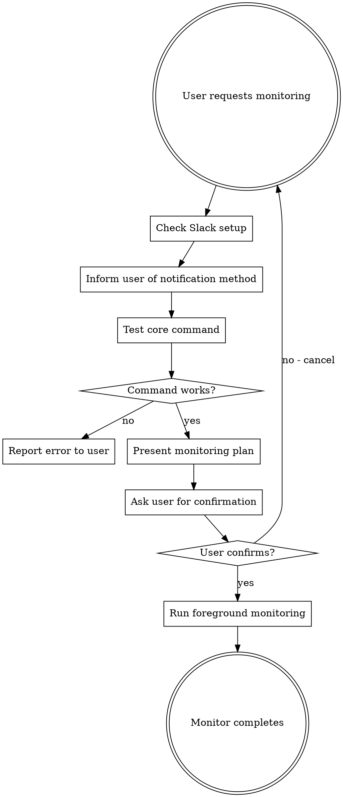

# Monitoring Konflux Resources

## Overview

**Foreground monitoring with proper error handling, Slack notifications, and terminal state detection.**

Core principle: Monitor reliably by checking configuration first, testing commands before monitoring, getting user confirmation, and handling errors gracefully.

## When to Use

Use this skill when user asks to:
- Monitor GitHub PRs ("monitor PR #123", "watch for PR to merge")
- Monitor GitHub Actions workflows ("monitor workflow run", "watch deploy workflow")
- Monitor Konflux PipelineRuns ("monitor pipelinerun xyz", "track build progress")
- Monitor Konflux Releases ("monitor release", "watch release complete")

**Key indicators:**
- User wants notification when resource completes
- User mentions Slack notifications
- Long-running resource that needs tracking
- User will be away and needs updates

**When NOT to use:**
- VolSync E2E test monitoring (has specialized result analysis - see CLAUDE.md)
- One-time status checks (just run the command directly)
- Background monitoring (user has given up on background - use foreground only)

## Quick Reference

### Resource Types and Terminal States

| Resource Type | Check Command | Terminal States | Status Field |
|--------------|---------------|-----------------|--------------|
| GitHub PR | `gh pr view <NUM> -R <repo> --json state` | MERGED, CLOSED | `.state` |
| GitHub Workflow | `gh run list --branch <branch> --limit 3` | completed, failure, cancelled | column 2 |
| Konflux PipelineRun | `oc get pipelinerun <name> -o jsonpath='{.status.conditions[0].reason}'` | Succeeded, Failed, Cancelled | `.status.conditions[0].reason` |
| Konflux Release | `oc get release <name> -o jsonpath='{.status.conditions[?(@.type=="Released")].reason}'` | Succeeded, Failed | `.status.conditions[?(@.type=="Released")].reason` |

### Timeout Guidelines

| Resource Type | Typical Duration | Max Timeout | Bash Tool Timeout |
|--------------|------------------|-------------|-------------------|
| PR | Hours to days | 48 hours | 172800000 (48hr) |
| Workflow | Minutes to hours | 4 hours | 14400000 (4hr) |
| PipelineRun | 1-2 hours | 4 hours | 14400000 (4hr) |
| Release | Minutes to hours | 4 hours | 14400000 (4hr) |

## Core Monitoring Workflow



**Step-by-step:**

1. **Check Slack setup first** (ALWAYS):
   ```bash
   if [ -n "$CLAUDE_SLACK_WEBHOOK_URL" ]; then
     echo "✅ Slack notifications configured"
   else
     echo "❌ Local OS notifications only (set CLAUDE_SLACK_WEBHOOK_URL for Slack)"
   fi
   ```

2. **Test the command** (verify auth, resource exists):
   ```bash
   # Example for PR monitoring
   gh pr view 276 -R stolostron/volsync-operator-product-build --json state
   # If this fails, stop - don't create monitoring script
   ```

3. **Present monitoring plan** (BEFORE starting):
   ```
   Core command: gh pr view 276 -R stolostron/volsync-operator-product-build --json state
   Monitoring interval: Every 5 minutes (300 seconds)
   What it monitors: PR state (watching for MERGED or CLOSED)
   Notifications: Slack (https://hooks.slack.com/...)
   Max duration: 48 hours with timeout protection
   ```

4. **Ask for confirmation** (MANDATORY):
   ```
   Ready to start foreground monitoring?
   Reply "yes" to start, or "no" to cancel.
   ```

5. **Run foreground monitoring** with proper error handling (see templates below)

## notify_user Function

**ALWAYS use file-based Slack JSON** (inline JSON fails with emojis):

```bash
notify_user() {
  local message="$1"
  local title="$2"

  # Send Slack notification if webhook URL is configured
  if [ -n "$CLAUDE_SLACK_WEBHOOK_URL" ]; then
    # Create temp JSON file to avoid escaping issues
    SLACK_JSON="/tmp/slack-notification-$$.json"
    cat > "$SLACK_JSON" << EOF
{
  "text": "*$title*\\n$message"
}
EOF
    curl -s -X POST -H 'Content-type: application/json' \
      -d @"$SLACK_JSON" "$CLAUDE_SLACK_WEBHOOK_URL" > /dev/null
    rm -f "$SLACK_JSON"
  else
    # Send local desktop notification only if Slack is not configured
    if [[ "$OSTYPE" == "darwin"* ]]; then
      osascript -e "display dialog \"$message\" with title \"$title\""
    elif [[ "$OSTYPE" == "linux-gnu"* ]]; then
      if command -v notify-send &> /dev/null; then
        notify-send "$title" "$message"
      elif command -v zenity &> /dev/null; then
        zenity --info --title="$title" --text="$message"
      else
        echo "🚨 $title: $message 🚨"
      fi
    else
      echo "🚨 $title: $message 🚨"
    fi
  fi
}
```

## Error Handling Pattern

**REQUIRED in all monitoring scripts:**

```bash
# Error tracking
ERROR_COUNT=0
MAX_ERRORS=3

# Inside monitoring loop
if [ $? -ne 0 ] || [[ -z "$CURRENT_STATUS" ]]; then
  ERROR_COUNT=$((ERROR_COUNT + 1))
  echo "Error getting status (attempt $ERROR_COUNT/$MAX_ERRORS)"

  # Check for authentication errors
  if echo "$OUTPUT" | grep -q "Unauthorized\|must be logged in\|authentication"; then
    notify_user "Authentication failure while monitoring. Please re-authenticate." "Auth Error"
    echo "❌ Monitoring stopped due to authentication failure"
    exit 1
  fi

  # Stop after max consecutive errors
  if [ $ERROR_COUNT -ge $MAX_ERRORS ]; then
    notify_user "Monitoring failed after $MAX_ERRORS consecutive errors. Check auth/connectivity." "Monitoring Error"
    echo "❌ Monitoring stopped due to persistent errors"
    exit 1
  fi

  # Retry with shorter interval
  sleep 30
  continue
else
  ERROR_COUNT=0  # Reset on success
fi
```

## Timeout Protection

**Track elapsed time and auto-stop:**

```bash
# At start of script
START_TIME=$(date +%s)
MAX_DURATION=$((48 * 60 * 60))  # 48 hours for PRs, 4 hours for PipelineRuns

# Inside monitoring loop
CURRENT_TIME=$(date +%s)
ELAPSED=$((CURRENT_TIME - START_TIME))

if [ $ELAPSED -ge $MAX_DURATION ]; then
  notify_user "Monitoring timed out after $(($MAX_DURATION/3600)) hours. Resource may still be in progress." "Timeout"
  echo "⏱️ Monitoring stopped due to timeout"
  exit 1
fi
```

## Terminal State Detection

**CRITICAL: Stop immediately when resource completes:**

```bash
# Example for PipelineRun
STATUS=$(oc get pipelinerun $PR_NAME -o jsonpath='{.status.conditions[0].reason}')

case "$STATUS" in
  "Succeeded")
    notify_user "PipelineRun $PR_NAME completed successfully! ✅" "Build Complete"
    echo "✅ PipelineRun succeeded"
    exit 0
    ;;
  "Failed"|"Cancelled")
    notify_user "PipelineRun $PR_NAME finished with status: $STATUS ❌" "Build Failed"
    echo "❌ PipelineRun $STATUS"
    exit 1
    ;;
  *)
    echo "Status: $STATUS - checking again in $INTERVAL seconds"
    ;;
esac
```

## Heartbeat Notifications

**Send periodic "still alive" messages:**

```bash
# Every 30 minutes
if [ $((ELAPSED % 1800)) -eq 0 ] && [ $ELAPSED -gt 0 ]; then
  HOURS=$((ELAPSED / 3600))
  MINUTES=$(((ELAPSED % 3600) / 60))
  notify_user "Still monitoring (${HOURS}h ${MINUTES}m elapsed)" "Monitoring Update"
fi
```

## Bash Tool Timeout

**CRITICAL: Set Bash tool timeout longer than script timeout:**

```bash
# If script has MAX_DURATION = 4 hours (14400 seconds)
# Bash tool timeout must be: 14400000 + 600000 = 15000000 ms (4hr 10min)

# Example Bash tool call:
{
  "command": "/tmp/monitor-script.sh",
  "timeout": 15000000  # Script max 4hr + 10min buffer
}
```

## Common Mistakes

| Mistake | Why It Fails | Fix |
|---------|--------------|-----|
| **Inline Slack JSON** | Emojis/newlines break escaping | Use file-based JSON with cat << EOF |
| **grep -c for counting** | Output has whitespace, breaks arithmetic | Use `wc -l` and force integer conversion |
| **Skip confirmation** | User doesn't know what's being monitored | ALWAYS ask for confirmation |
| **Wrong Release status field** | `.status` is True/False, not status | Use `.status.conditions[?(@.type=="Released")].reason` |
| **No error handling** | Silent failures, auth errors | Add consecutive failure counter + auth detection |
| **Continue after terminal state** | Wastes resources, auth errors | Add explicit exit after Succeeded/Failed |
| **Bash timeout < script timeout** | Script killed before completion | Bash timeout ≥ script timeout + 10min |
| **No heartbeat** | Can't tell if script died or still running | Send notification every 30 min |

## Bash Arithmetic Gotchas

**Force integer conversion for arithmetic:**

```bash
# ❌ BROKEN
PASS_COUNT=$(grep -c "State: pass" file.log)
PASS_RATE=$((PASS_COUNT * 100 / TOTAL))  # Fails with whitespace

# ✅ CORRECT
PASS_COUNT=$(grep "State: pass" file.log | wc -l)
PASS_COUNT=$((PASS_COUNT + 0))  # Force integer conversion
PASS_RATE=$((PASS_COUNT * 100 / TOTAL))
```

**Nested arithmetic syntax:**

```bash
# ❌ BROKEN
echo "Time: $(($ELAPSED/3600))h ${$(($ELAPSED%3600/60))}m"

# ✅ CORRECT
HOURS=$((ELAPSED / 3600))
MINUTES=$(((ELAPSED % 3600) / 60))
echo "Time: ${HOURS}h ${MINUTES}m"
```

## Common Rationalizations (STOP and Follow Workflow)

| Rationalization | Reality | Action |
|----------------|---------|--------|
| "User said immediately, skip confirmation" | Confirmation prevents misunderstandings | ALWAYS confirm |
| "Inline JSON is simpler" | Fails with emojis every time | ALWAYS use file-based |
| "It worked before, reuse that pattern" | Different resources have different fields | Check status field for THIS resource |
| "Basic monitoring is enough" | Auth errors and timeouts WILL happen | ALWAYS add full error handling |
| "Don't bother user with Slack check" | User needs to know notification method | ALWAYS check and inform |
| "Command should work" | Auth expires, resources may not exist | ALWAYS test command first |
| "Skip error handling for quick check" | No such thing as "quick" - all need error handling | Add error handling |

**All of these mean: Follow the workflow. No exceptions.**

## Status Reporting Conventions

- ✅ **Green checkmark**: Monitoring worked AND resource completed successfully
- ❌ **Red X**: Either monitoring failed OR resource failed
- 🔄 **In progress**: Still actively monitoring
- ⏱️ **Clock**: Timeout occurred

**Never use ✅ for failed outcomes** - this misleads users.

## Example: Complete PR Monitoring Script

```bash
#!/bin/bash

# Configuration
PR_NUM="276"
REPO="stolostron/volsync-operator-product-build"
INTERVAL=300  # 5 minutes
MAX_DURATION=$((48 * 60 * 60))  # 48 hours
START_TIME=$(date +%s)
ERROR_COUNT=0
MAX_ERRORS=3

# notify_user function
notify_user() {
  local message="$1"
  local title="$2"

  if [ -n "$CLAUDE_SLACK_WEBHOOK_URL" ]; then
    SLACK_JSON="/tmp/slack-notification-$$.json"
    cat > "$SLACK_JSON" << EOF
{
  "text": "*$title*\\n$message"
}
EOF
    curl -s -X POST -H 'Content-type: application/json' \
      -d @"$SLACK_JSON" "$CLAUDE_SLACK_WEBHOOK_URL" > /dev/null
    rm -f "$SLACK_JSON"
  else
    if [[ "$OSTYPE" == "darwin"* ]]; then
      osascript -e "display dialog \"$message\" with title \"$title\""
    fi
  fi
}

echo "Starting monitoring of PR #$PR_NUM in $REPO"
echo "Interval: $INTERVAL seconds"
echo "Max duration: $((MAX_DURATION / 3600)) hours"

# Monitoring loop
while true; do
  echo "=== $(date) ==="

  # Get PR status
  OUTPUT=$(gh pr view $PR_NUM -R $REPO --json state 2>&1)

  if [ $? -ne 0 ]; then
    ERROR_COUNT=$((ERROR_COUNT + 1))
    echo "Error getting PR status (attempt $ERROR_COUNT/$MAX_ERRORS)"

    if echo "$OUTPUT" | grep -q "Unauthorized\|authentication"; then
      notify_user "Auth failure monitoring PR #$PR_NUM. Re-authenticate and restart." "Auth Error"
      exit 1
    fi

    if [ $ERROR_COUNT -ge $MAX_ERRORS ]; then
      notify_user "Monitoring failed after $MAX_ERRORS errors for PR #$PR_NUM" "Error"
      exit 1
    fi

    sleep 30
    continue
  else
    ERROR_COUNT=0
  fi

  STATE=$(echo "$OUTPUT" | jq -r '.state')

  # Check terminal states
  case "$STATE" in
    "MERGED")
      notify_user "$REPO PR #$PR_NUM has been MERGED! 🚀\\nhttps://github.com/$REPO/pull/$PR_NUM" "PR Merged"
      echo "✅ PR merged successfully"
      exit 0
      ;;
    "CLOSED")
      notify_user "$REPO PR #$PR_NUM was CLOSED without merging\\nhttps://github.com/$REPO/pull/$PR_NUM" "PR Closed"
      echo "❌ PR closed"
      exit 1
      ;;
    *)
      echo "Status: $STATE - checking again in $INTERVAL seconds"
      ;;
  esac

  # Timeout check
  CURRENT_TIME=$(date +%s)
  ELAPSED=$((CURRENT_TIME - START_TIME))

  if [ $ELAPSED -ge $MAX_DURATION ]; then
    notify_user "Monitoring of PR #$PR_NUM timed out after 48 hours" "Timeout"
    exit 1
  fi

  # Heartbeat every 30 minutes
  if [ $((ELAPSED % 1800)) -eq 0 ] && [ $ELAPSED -gt 0 ]; then
    HOURS=$((ELAPSED / 3600))
    MINUTES=$(((ELAPSED % 3600) / 60))
    notify_user "Still monitoring PR #$PR_NUM (${HOURS}h ${MINUTES}m elapsed)" "Update"
  fi

  sleep $INTERVAL
done
```

## Red Flags - STOP and Follow Workflow

- Creating monitoring script without checking Slack first
- Starting monitoring without user confirmation
- Using inline Slack JSON instead of file-based
- No error handling in monitoring loop
- Missing terminal state detection
- Bash timeout shorter than script timeout
- No timeout protection (max duration check)
- Skipping command test ("it should work")
- Wrong status field for resource type

**All of these mean: Stop. Follow the workflow above. No shortcuts.**
